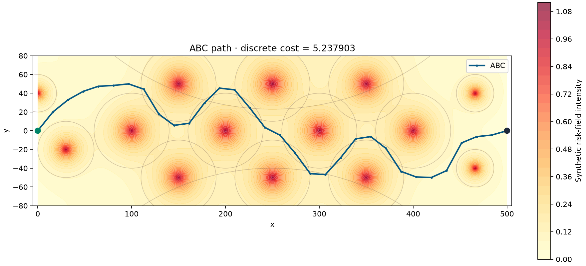

# UAV Path Planning · ABC and PSO

Four runnable implementations of a numerical path-planning example: **MATLAB, Python, C++, and Julia**. A path crosses a synthetic two-dimensional risk field, balancing exposure against distance. Artificial Bee Colony (ABC) is the default optimizer; Particle Swarm Optimization (PSO) provides a comparison on the same scene.

*Generated by Python with 500 iterations and seed 1. The background is the continuous field; the objective samples it at the interior nodes.*

## Start here

Clone [this repository](https://github.com/libai1943/UAV-Path-Planning) and enter its directory.

| Version | Requirements | Entry point | Outputs |
|---|---|---|---|
| MATLAB | R2019a+; base MATLAB | matlab/RunMe.m | Two figures, CSV, MAT |
| Python | Python 3.10+, NumPy, Matplotlib | python/RunMe.py | Two figures, PNG, CSV |
| C++ | C++17 compiler, CMake 3.16+ | cpp/src/main.cpp | CSV and standalone SVG |
| Julia | Julia 1.10+; standard library only | julia/RunMe.jl | CSV and standalone SVG |

The folders are independent. No AMPL, CasADi, external optimizer, or MATLAB toolbox is needed.

### MATLAB — run and plot

Open matlab/RunMe.m and press **Run**, or execute from the repository root:

~~~matlab
addpath('matlab');
result = RunMe;                 % ABC, 500 iterations, seed 1
% result = RunMe('pso',500,1);   % optional comparison
~~~

The first figure shows the path and risk field; the second shows convergence. Files are written to matlab/results/.

### Python — run and plot

~~~bash
python -m venv .venv
# Windows PowerShell:
.venv\Scripts\Activate.ps1
# Linux/macOS: source .venv/bin/activate
python -m pip install -r python/requirements.txt
python python/RunMe.py
~~~

This opens both figures and saves them under python/results/. For a noninteractive machine, add --no-show. Select PSO or another iteration budget with:

~~~bash
python python/RunMe.py --algorithm pso --iterations 500 --seed 1 --no-show
~~~

### C++ — build and run

Install CMake and a C++ compiler (GCC, Clang, or Visual Studio C++ Build Tools):

~~~bash
cmake -S cpp -B cpp/build -DCMAKE_BUILD_TYPE=Release
cmake --build cpp/build --config Release
./cpp/build/uav_demo --algorithm abc --output cpp/results
~~~

With Visual Studio's multi-configuration generator, the executable is cpp/build/Release/uav_demo.exe. With MinGW it is cpp/build/uav_demo.exe. Open cpp/results/path.svg in a browser.

### Julia — no package installation

Install [Julia](https://julialang.org/downloads/) and put julia on your PATH:

~~~bash
julia julia/RunMe.jl
julia julia/RunMe.jl --algorithm pso --iterations 500 --seed 1
~~~

Results are written to julia/results/. Open path.svg in a browser. Only Julia's Random standard library is used.

## Model and defaults

The start is (0,0) and the goal is (500,0). Thirty interior nodes have fixed longitudinal positions x_i = 500 i / 31; their lateral coordinates are the decision variables, bounded by -50 <= y_i <= 50. Sixteen sources define the synthetic field. Source j, centered at c_j with radius parameter R_j, contributes:

~~~text
q_j(p) = exp(-log(20) * norm(p - c_j) / R_j)
J = sum_{i=1..30,j=1..16} q_j(p_i)
    + sum_{i=1..29} norm(p_{i+1} - p_i) / 500
~~~

This preserves the archived calcu.m / fitness.m discrete objective. The start-to-first-node and last-node-to-goal segments are drawn and exported, but are **not included in this archived cost definition**. Source circles are individual q_j = 0.05 contours, not hard forbidden obstacles. This example optimizes a sampled soft-risk objective; it does not impose hard collision constraints or vehicle dynamics.

| Setting | ABC | PSO |
|---|---:|---:|
| Iterations | 500 | 500 |
| Population | 20 food sources | 40 particles |
| Initialization | Uniform within bounds | Uniform within bounds |
| Main parameters | Abandonment limit = 0.1 × iterations | Inertia 0.7298; learning factors 1.4962 |

ABC uses employed, onlooker, and scout stages. PSO maintains personal and global best solutions. These shared defaults make the four ports easy to compare; the historical root scripts retain their original experiment settings. Random-number generators differ across languages, so an identical seed does not imply an identical trajectory.

## Code architecture

~~~mermaid
flowchart LR
    A[Scenario and source field] --> B[Path representation]
    B --> C{Optimizer}
    C --> D[ABC: employed / onlooker / scout]
    C --> E[PSO: velocity / personal best / global best]
    D --> F[Discrete cost]
    E --> F
    F --> C
    C --> G[Best path and convergence]
    G --> H[CSV and plots]
~~~

| File | Responsibility |
|---|---|
| matlab/Scenario.m | Source coordinates, radius parameters, path dimension and bounds |
| matlab/PathCost.m | Discrete exposure-plus-distance objective |
| matlab/OptimizePath.m | ABC and PSO loops, seeded randomness, best-so-far history |
| matlab/PlotResult.m | Static path and convergence figures |
| matlab/RunMe.m | One-click setup, optimization, plots, export |
| python/planner.py | Scenario, objective, and both algorithms |
| python/RunMe.py | CLI options, two plots, CSV/PNG export |
| cpp/src/planner.hpp | Standard-library scenario and optimizers |
| cpp/src/main.cpp | CLI, CSV export, dependency-free SVG writer |
| julia/Planner.jl | Scenario, objective, algorithms, CSV/SVG export |
| julia/RunMe.jl | CLI and output-directory handling |

path.csv contains the start, 30 interior nodes, and goal. convergence.csv contains one best-so-far cost per iteration. MATLAB and Python produce exactly two figures. C++ and Julia write their plot without opening a GUI.

Root MATLAB scripts and MAT files remain as historical experiments. calcu.m and fitness.m contain the original objective; calculateFitness.m maps objective values to ABC fitness; cir_plot.m draws the original circles. Use the four folders above for the current runnable examples. The included PDFs provide the original publication and related research; these compact ports implement ABC/PSO for the archived objective, not every algorithm in those papers.

## Validation

Both algorithms have been run for 500 iterations in all four languages: MATLAB R2021b, Python with NumPy/Matplotlib, GCC 16.2, and Julia 1.13.1. Exported paths were checked for dimensions, fixed endpoints, bounds, monotone best-so-far histories, and independently recomputed objective values. The illustrated Python ABC run gives J = 5.237903; this is one stochastic run, not a global optimality or statistical benchmark claim.

## Citation

Please cite:

> Bai Li, Ligang Gong, and Chunhui Zhao, “Unmanned Combat Aerial Vehicles Path Planning Using a Novel Probability Density Model Based on Artificial Bee Colony Algorithm,” *2013 Fourth International Conference on Intelligent Control and Information Processing (ICICIP)*, pp. 620–625, 2013.

~~~bibtex
@inproceedings{li2013ucav,
  author = {Li, Bai and Gong, Ligang and Zhao, Chunhui},
  title = {Unmanned Combat Aerial Vehicles Path Planning Using a Novel Probability Density Model Based on Artificial Bee Colony Algorithm},
  booktitle = {2013 Fourth International Conference on Intelligent Control and Information Processing (ICICIP)},
  pages = {620--625},
  year = {2013},
  organization = {IEEE}
}
~~~

## License

The repository retains its [GNU GPL v3.0 license](LICENSE).
